# Nano Claude Code Plugins

[中文文档](./README_ZH.md)

A marketplace of productivity and development workflow plugins for Claude Code, featuring the PRP (Product Requirements Prompt) methodology for AI-driven software development.

> **Attribution**: This project is based on [PRPs-agentic-eng](https://github.com/Wirasm/PRPs-agentic-eng) by [Wirasm](https://github.com/Wirasm). We have reorganized and adapted the original work into a modular plugin marketplace format. All credit for the PRP methodology and core concepts goes to the original author.

## Overview

This marketplace provides a high-quality plugin that extends Claude Code's capabilities through the **PRP methodology** - where **PRP = PRD + curated codebase intelligence + agent/runbook**. The PRP approach enables AI agents to ship production-ready code on the first pass by providing comprehensive context, step-by-step implementation plans, and executable validation gates.

### What is PRP?

A PRP (Product Requirements Prompt) is a comprehensive implementation document that contains:

1. **Context** - All necessary patterns, documentation, and examples from your codebase
2. **Plan** - Step-by-step tasks with validation gates
3. **Validation** - Executable commands to verify correctness

### Core Principles

- **Context is King** - Include ALL necessary information for implementation success
- **Validation Loops** - Provide executable tests the AI can run and fix
- **Information Dense** - Use keywords and patterns from your codebase
- **Progressive Success** - Start simple, validate, enhance

## Available Plugin

### prp-core

**Version:** 1.0.0 | **Author:** NanoBoom | **Category:** Development

Complete PRP workflow system providing comprehensive commands for planning, implementation, debugging, issue management, and code review.

**Features:**
- Complete development lifecycle (PRD → Plan → Implementation → Review → PR)
- Autonomous development with Ralph agent
- Interactive debugging capabilities
- Issue investigation and systematic fixing
- Code quality and review automation
- Git integration with smart commits

**Commands (14):**

| Command | Description |
|---------|-------------|
| `/prp-create` | Quick feature PRP creation for simple requirements |
| `/prp-execute` | Execute a feature PRP until fully complete |
| `/prp-prd` | Generate comprehensive Product Requirement Documents with deep analysis |
| `/prp-plan` | Create detailed implementation plans with validation gates |
| `/prp-implement` | Execute PRPs with systematic validation and quality checks |
| `/prp-debug` | Interactive debugging with step-by-step analysis |
| `/prp-issue-investigate` | Deep investigation of issues with systematic analysis |
| `/prp-issue-fix` | Systematic issue fixing with validation loops |
| `/prp-review` | Comprehensive code review with best practices validation |
| `/prp-commit` | Create atomic git commits with proper messages |
| `/prp-pr` | Create pull requests with comprehensive descriptions |
| `/prp-ralph` | Launch autonomous development agent for end-to-end features |
| `/prp-ralph-cancel` | Cancel the running Ralph agent |
| `/install` | Install and configure PRP system |

**Agents (2):**

| Agent | Description |
|-------|-------------|
| `codebase-analyst` | Deep codebase pattern analysis, architecture discovery, and convention detection |
| `library-researcher` | External library documentation research, API discovery, and best practices identification |

[Learn more →](./plugins/prp-core/README.md)

---

## Installation

### Quick Start

```bash
# Add this marketplace to Claude Code
/plugin marketplace add https://github.com/NanoBoom/nano-claude-code-plugins.git

# Browse available plugins
/plugin

# Install prp-core
/plugin install prp-core@nano-claude-code-plugins
```

### Local Development

```bash
# Clone the repository
git clone https://github.com/NanoBoom/nano-claude-code-plugins.git
cd nano-claude-code-plugins

# Start Claude Code
claude

# Add local marketplace (use absolute path)
/plugin marketplace add /absolute/path/to/nano-claude-code-plugins

# Install plugin
/plugin install prp-core@nano-claude-code-plugins

# Restart Claude Code for commands to load
```

### Team Installation

Add to your project's `.claude/settings.json`:

```json
{
  "extraKnownMarketplaces": {
    "nano-claude-code-plugins": {
      "source": "NanoBoom/nano-claude-code-plugins"
    }
  },
  "enabledPlugins": [
    "prp-core@nano-claude-code-plugins"
  ]
}
```

Team members who trust the repository will automatically have the plugin installed.

## PRP Workflow Diagrams

### 1. PRP Methodology Architecture


### 2. Complete Feature Development Workflow


### 3. Ralph Autonomous Development

```mermaid
flowchart TD
    Start([Start: Feature Request]) --> Ralph["/prp-ralph<br/>🤖 Autonomous Agent"]

    Ralph --> Phase1["Phase 1: Research & Planning<br/>🔍 Analyze codebase<br/>📝 Generate comprehensive PRD"]
    Phase1 --> Checkpoint1{User Approval?}
    Checkpoint1 -->|No| Refine1[Refine PRD]
    Refine1 --> Phase1

    Checkpoint1 -->|Yes| Phase2["Phase 2: Design<br/>🎯 Create implementation plan<br/>✅ Define validation gates"]
    Phase2 --> Checkpoint2{User Approval?}
    Checkpoint2 -->|No| Refine2[Refine Plan]
    Refine2 --> Phase2

    Checkpoint2 -->|Yes| Phase3["Phase 3: Implementation<br/>💻 Write code<br/>🧪 Run tests<br/>🔄 Validation loop"]

    Phase3 --> Validate{All Validations<br/>Pass?}
    Validate -->|No| AutoFix["🔧 Auto-fix Issues<br/>Re-run validations"]
    AutoFix --> Validate

    Validate -->|Yes| Phase4["Phase 4: Quality Assurance<br/>📊 Code review<br/>🔍 Security check<br/>📈 Performance review"]

    Phase4 --> QualityCheck{Quality Gates<br/>Pass?}
    QualityCheck -->|No| Improve[Improve Code]
    Improve --> Phase4

    QualityCheck -->|Yes| Phase5["Phase 5: Delivery<br/>📦 Create commit<br/>🚀 Create PR with docs"]
    Phase5 --> End([End: Ready for Review])

    Ralph -.->|Can cancel anytime| Cancel["/prp-ralph-cancel"]

    style Start fill:#E1F5FE,stroke:#01579B
    style End fill:#C8E6C9,stroke:#1B5E20
    style Ralph fill:#9C27B0,stroke:#4A148C,color:#fff
    style Phase1 fill:#CE93D8,stroke:#6A1B9A
    style Phase2 fill:#CE93D8,stroke:#6A1B9A
    style Phase3 fill:#CE93D8,stroke:#6A1B9A
    style Phase4 fill:#CE93D8,stroke:#6A1B9A
    style Phase5 fill:#CE93D8,stroke:#6A1B9A
    style Cancel fill:#EF5350,stroke:#B71C1C,color:#fff
```



### 4. Bug Investigation & Fix Workflow

```mermaid
flowchart TD
    Start([Bug Report]) --> Investigate["/prp-issue-investigate<br/>Deep Investigation"]

    Investigate --> Analysis["🔍 Analysis Steps:<br/>• Multi-angle analysis<br/>• Pattern recognition<br/>• Related issues<br/>• Root cause identification"]

    Analysis --> Report["📄 Investigation Report<br/>PRPs/investigations/*.md"]
    Report --> Review{Clear Root<br/>Cause?}

    Review -->|No| MoreInvest[Deeper Investigation]
    MoreInvest --> Investigate

    Review -->|Yes| Fix["/prp-issue-fix<br/>Systematic Fix"]

    Fix --> Implementation["💻 Fix Implementation:<br/>• Code changes<br/>• Test coverage<br/>• Regression prevention"]

    Implementation --> Validate{Tests Pass?}
    Validate -->|No| Debug["/prp-debug<br/>Interactive Debug"]
    Debug --> Fix

    Validate -->|Yes| Verify["✅ Verification:<br/>• Original issue fixed<br/>• No regressions<br/>• Edge cases covered"]

    Verify --> VerifyCheck{Verified?}
    VerifyCheck -->|No| Fix
    VerifyCheck -->|Yes| Commit["/prp-commit<br/>Commit Fix"]

    Commit --> PR["/prp-pr<br/>Create Fix PR"]
    PR --> End([End: Fix Complete])

    style Start fill:#FFCDD2,stroke:#B71C1C
    style End fill:#C8E6C9,stroke:#1B5E20
    style Investigate fill:#FFCCBC,stroke:#E64A19
    style Fix fill:#FFCCBC,stroke:#E64A19
    style Debug fill:#FFE0B2,stroke:#EF6C00
```



### 5. PRP Command Ecosystem


## Quick Reference

### Quick Feature Development (Simple Requirements)

```bash
# 1. Create feature PRP with codebase analysis
/prp-create "Add pagination to user list API"

# 2. Execute the PRP with validation
/prp-execute .claude/PRPs/features/add-pagination.md

# 3. Commit and create PR
/prp-commit
/prp-pr "feat: add pagination to user list"
```

### Complete Feature Development (Complex Features)

```bash
# 1. Create PRD with deep codebase analysis
/prp-prd "Add user authentication with JWT"

# 2. Create implementation plan
/prp-plan PRPs/features/add-user-authentication.prd.md

# 3. Implement the feature with validation
/prp-implement PRPs/features/add-user-authentication.plan.md

# 4. Review the changes
/prp-review src/auth/

# 5. Commit with smart message generation
/prp-commit

# 6. Create pull request
/prp-pr "feat: add JWT authentication"
```

### Autonomous Development with Ralph

```bash
# Ralph handles the entire workflow automatically
/prp-ralph "Add user authentication with JWT and session management"

# Ralph will:
# - Generate comprehensive PRD
# - Create detailed implementation plan
# - Implement the feature
# - Run validation checks
# - Create commit and PR
```

### Bug Investigation & Fix Workflow

```bash
# 1. Investigate the issue systematically
/prp-issue-investigate "Users can't login after password reset"

# 2. Fix the issue with validation
/prp-issue-fix PRPs/investigations/login-after-reset.md

# 3. Commit the fix
/prp-commit

# 4. Create PR
/prp-pr "fix: resolve login issue after password reset"
```

### Interactive Debugging

```bash
# Debug with step-by-step analysis
/prp-debug "TypeError: Cannot read property 'id' of undefined in user profile"
```

## Plugin Development

### Creating a New Plugin

1. **Create plugin directory structure:**
   ```bash
   mkdir -p plugins/your-plugin/.claude-plugin
   mkdir -p plugins/your-plugin/commands
   mkdir -p plugins/your-plugin/agents
   ```

2. **Create plugin.json:**
   ```json
   {
     "name": "your-plugin",
     "description": "Your plugin description",
     "version": "1.0.0",
     "author": {
       "name": "Your Name",
       "email": "your.email@example.com"
     }
   }
   ```

3. **Add commands, agents, or skills as needed**

4. **Update marketplace.json to include your plugin**

### Plugin Structure

```
plugins/
└── your-plugin/
    ├── .claude-plugin/
    │   └── plugin.json       # Plugin metadata
    ├── commands/              # Slash commands (*.md)
    │   └── command.md
    ├── agents/                # AI agents (*.md)
    │   └── agent.md
    ├── skills/                # Skills
    │   └── skill-name/
    │       └── SKILL.md
    ├── hooks/                 # Event handlers
    │   └── hooks.json
    ├── .mcp.json             # MCP server configuration
    └── README.md             # Plugin documentation
```

## Marketplace Management

### For Plugin Users

| Command | Description |
|---------|-------------|
| `/plugin` | Browse available plugins |
| `/plugin install [name]@nano-claude-code-plugins` | Install a plugin |
| `/plugin update [name]@nano-claude-code-plugins` | Update a plugin |
| `/plugin uninstall [name]@nano-claude-code-plugins` | Uninstall a plugin |

### For Plugin Developers

1. Fork this repository
2. Create your plugin in the `plugins/` directory
3. Update `.claude-plugin/marketplace.json` with your plugin information
4. Submit a pull request

## Contributing

We welcome contributions! Please follow these guidelines:

1. **Plugin Quality Standards:**
   - Complete documentation in README.md
   - Proper error handling in commands and agents
   - Follow Claude Code plugin specification
   - Include examples and usage instructions

2. **Testing:**
   - Test your plugin locally before submitting
   - Ensure all commands and agents work as expected
   - Verify compatibility with latest Claude Code version

3. **Pull Request Process:**
   - Create a feature branch for your plugin
   - Update marketplace.json with plugin metadata
   - Include screenshots or demos if applicable
   - Provide clear description of plugin functionality

## Support

- **Issues:** [GitHub Issues](https://github.com/NanoBoom/nano-claude-code-plugins/issues)
- **Documentation:** [Claude Code Plugins Docs](https://docs.claude.com/en/docs/claude-code/plugins)
- **Contact:** cinuor@gmail.com

## License

This marketplace and its plugins are released under the MIT License.

## Changelog

### v1.2.0 (2025-01-12)
- Consolidated into single comprehensive prp-core plugin
- Added 12 commands covering complete development lifecycle
- Added 2 specialized agents for codebase and library research
- Removed prp-main and prp-agents (merged into prp-core)
- Updated documentation and examples

### v1.1.0 (2025-12-09)
- Updated documentation to reflect all 3 plugins
- Added comprehensive command reference tables
- Improved installation instructions
- Added quick reference workflow examples

### v1.0.0 (2024-10-10)
- Initial marketplace release
- Added prp-main plugin (14 commands)
- Added prp-agents plugin (2 agents)
- Added prp-core plugin (8 commands, 1 skill)
- Established plugin development guidelines
- Created marketplace infrastructure

---

**Made with NanoBoom**
