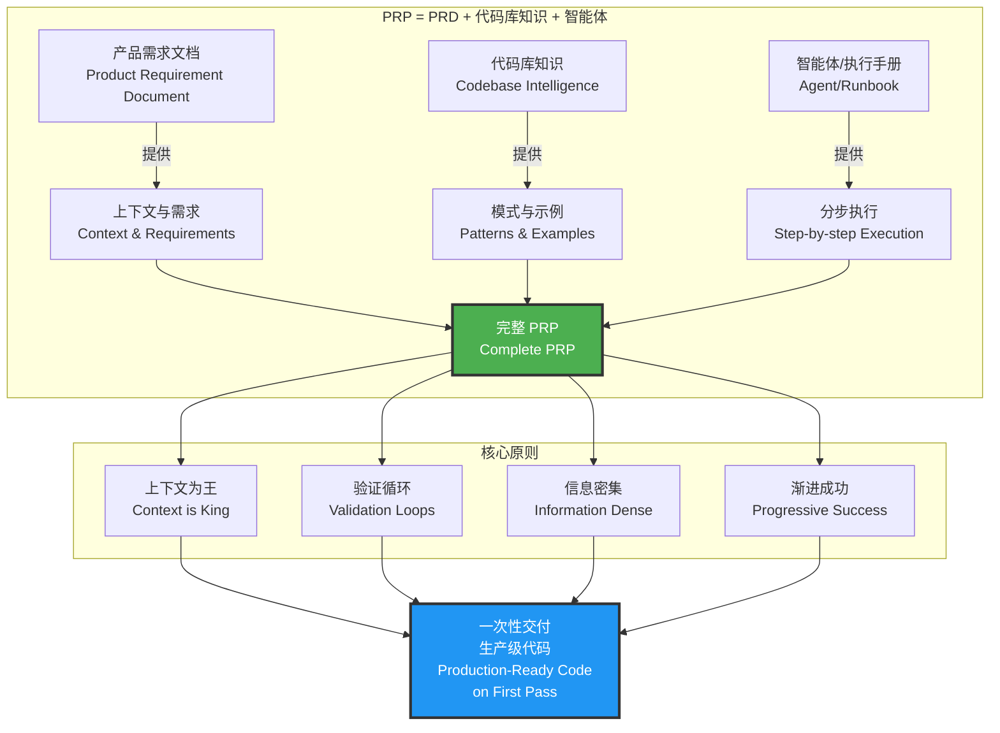
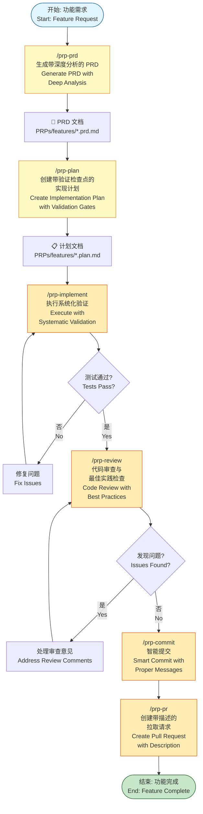
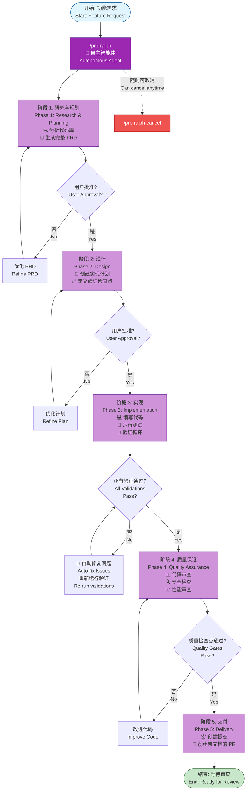
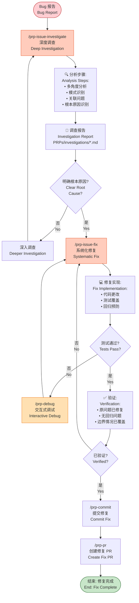
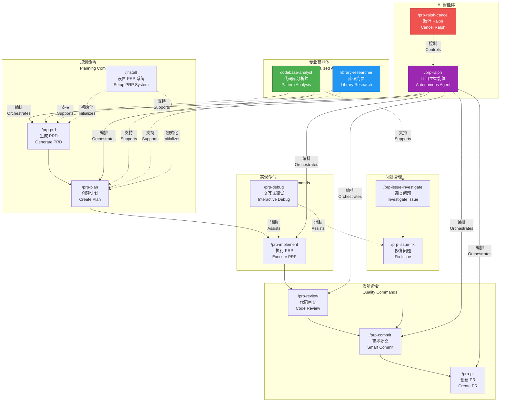

# Nano Claude Code 插件市场

[English Documentation](./README.md)

为 Claude Code 打造的生产力和开发工作流插件市场，采用 PRP（产品需求提示词）方法论实现 AI 驱动的软件开发。

> **致谢**: 本项目基于 [Wirasm](https://github.com/Wirasm) 的 [PRPs-agentic-eng](https://github.com/Wirasm/PRPs-agentic-eng) 项目。我们将原始工作重新组织并改编为模块化的插件市场格式。PRP 方法论和核心概念的所有功劳归原作者所有。

## 概述

本插件市场通过 **PRP 方法论** 扩展 Claude Code 的能力 - 其中 **PRP = PRD + 精选代码库知识 + 智能体/执行手册**。PRP 方法通过提供完整的上下文、分步实施计划和可执行的验证检查点，使 AI 智能体能够一次性交付生产级代码。

### 什么是 PRP？

PRP（产品需求提示词）是一份完整的实施文档，包含：

1. **上下文** - 代码库中所有必要的模式、文档和示例
2. **计划** - 带有验证检查点的分步任务
3. **验证** - 用于确认正确性的可执行命令

### 核心原则

- **上下文为王** - 包含实施成功所需的所有信息
- **验证循环** - 提供 AI 可以运行和修复的可执行测试
- **信息密集** - 使用代码库中的关键词和模式
- **渐进成功** - 从简单开始，验证，然后增强

## 可用插件

### prp-core

**版本:** 1.0.0 | **作者:** NanoBoom | **分类:** 开发

完整的 PRP 工作流系统，提供规划、实现、调试、问题管理和代码审查的全面命令。

**特性:**
- 完整的开发生命周期 (PRD → 计划 → 实现 → 审查 → PR)
- Ralph 自主开发智能体
- 交互式调试能力
- 问题调查和系统化修复
- 代码质量和审查自动化
- 智能提交的 Git 集成

**命令 (15个):**

| 命令 | 描述 |
|------|------|
| `/prp-create` | 快速创建功能 PRP，适用于简单需求 |
| `/prp-execute` | 执行功能 PRP 直到完全完成 |
| `/prp-prd` | 生成带深度分析的完整产品需求文档 |
| `/prp-plan` | 创建带验证检查点的详细实现计划 |
| `/prp-implement` | 执行 PRP，带系统化验证和质量检查 |
| `/prp-debug` | 带逐步分析的交互式调试 |
| `/prp-issue-investigate` | 带系统化分析的深度问题调查 |
| `/prp-issue-fix` | 带验证循环的系统化问题修复 |
| `/prp-review` | 带最佳实践验证的全面代码审查 |
| `/prp-review-agents` | 多智能体 PR 审查，提供专业化分析（注释、测试、错误、类型、代码质量、文档、简化） |
| `/prp-commit` | 创建带合适消息的原子 git 提交 |
| `/prp-pr` | 创建带完整描述的拉取请求 |
| `/prp-ralph` | 启动端到端功能开发的自主开发智能体 |
| `/prp-ralph-cancel` | 取消正在运行的 Ralph 智能体 |
| `/install` | 安装和配置 PRP 系统 |

**智能体 (10个):**

| 智能体 | 描述 |
|--------|------|
| `codebase-analyst` | 深度代码库模式分析、架构发现和约定检测 |
| `codebase-explorer` | 全面的代码库探索 - 找到代码位置并展示实现方式 |
| `code-reviewer` | 代码审查，检查项目规范合规性、bug 和质量问题，采用高置信度过滤 |
| `code-simplifier` | 代码简化，在保持功能的同时提升清晰度 - 降低复杂度并应用项目标准 |
| `comment-analyzer` | 注释分析，检查准确性、完整性和长期价值 - 防止注释腐化 |
| `docs-impact-agent` | 文档影响分析，更新受代码更改影响的文档 - 修复过时文档并选择性添加新条目 |
| `pr-test-analyzer` | PR 测试覆盖率分析，评估质量和完整性 - 关注行为覆盖 |
| `silent-failure-hunter` | 静默失败猎手，查找静默失败和不充分的错误处理 - 零容忍吞没错误 |
| `type-design-analyzer` | 类型设计分析，评估封装、不变量表达和强制质量 |
| `web-researcher` | Web 研究员，搜索训练数据之外的现代文档、最新 API 和当前最佳实践 |

[了解更多 →](./plugins/prp-core/README.md)

---

## 安装

### 快速开始

```bash
# 将此市场添加到 Claude Code
/plugin marketplace add https://github.com/NanoBoom/nano-claude-code-plugins.git

# 浏览可用插件
/plugin

# 安装 prp-core
/plugin install prp-core@nano-claude-code-plugins
```

### 本地开发

```bash
# 克隆仓库
git clone https://github.com/NanoBoom/nano-claude-code-plugins.git
cd nano-claude-code-plugins

# 启动 Claude Code
claude

# 添加本地市场（使用绝对路径）
/plugin marketplace add /absolute/path/to/nano-claude-code-plugins

# 安装插件
/plugin install prp-core@nano-claude-code-plugins

# 重启 Claude Code 以加载命令
```

### 团队安装

添加到项目的 `.claude/settings.json`：

```json
{
  "extraKnownMarketplaces": {
    "nano-claude-code-plugins": {
      "source": "NanoBoom/nano-claude-code-plugins"
    }
  },
  "enabledPlugins": [
    "prp-core@nano-claude-code-plugins"
  ]
}
```

信任该仓库的团队成员将自动安装插件。

## PRP 工作流程图

### 1. PRP 方法论架构



### 2. 完整功能开发工作流



### 3. Ralph 自主开发流程



### 4. Bug 调查与修复工作流



### 5. PRP 命令生态系统



## 快速参考

### 快速功能开发（简单需求）

```bash
# 1. 创建带代码库分析的功能 PRP
/prp-create "为用户列表 API 添加分页功能"

# 2. 执行 PRP 并进行验证
/prp-execute .claude/PRPs/features/add-pagination.md

# 3. 提交并创建 PR
/prp-commit
/prp-pr "feat: add pagination to user list"
```

### 完整功能开发（复杂功能）

```bash
# 1. 创建带深度代码库分析的 PRD
/prp-prd "添加 JWT 用户认证"

# 2. 创建实现计划
/prp-plan PRPs/features/add-user-authentication.prd.md

# 3. 带验证的功能实现
/prp-implement PRPs/features/add-user-authentication.plan.md

# 4. 审查更改
/prp-review src/auth/

# 5. 带智能消息生成的提交
/prp-commit

# 6. 创建拉取请求
/prp-pr "feat: add JWT authentication"
```

### Ralph 自主开发

```bash
# Ralph 自动处理整个工作流
/prp-ralph "添加带会话管理的 JWT 用户认证"

# Ralph 会：
# - 生成完整的 PRD
# - 创建详细的实现计划
# - 实现功能
# - 运行验证检查
# - 创建提交和 PR
```

### Bug 调查和修复工作流

```bash
# 1. 系统化调查问题
/prp-issue-investigate "用户密码重置后无法登录"

# 2. 带验证的问题修复
/prp-issue-fix PRPs/investigations/login-after-reset.md

# 3. 提交修复
/prp-commit

# 4. 创建 PR
/prp-pr "fix: resolve login issue after password reset"
```

### 交互式调试

```bash
# 带逐步分析的调试
/prp-debug "TypeError: Cannot read property 'id' of undefined in user profile"
```

## 插件开发

### 创建新插件

1. **创建插件目录结构:**
   ```bash
   mkdir -p plugins/your-plugin/.claude-plugin
   mkdir -p plugins/your-plugin/commands
   mkdir -p plugins/your-plugin/agents
   ```

2. **创建 plugin.json:**
   ```json
   {
     "name": "your-plugin",
     "description": "你的插件描述",
     "version": "1.0.0",
     "author": {
       "name": "你的名字",
       "email": "your.email@example.com"
     }
   }
   ```

3. **根据需要添加命令、智能体或技能**

4. **更新 marketplace.json 以包含你的插件**

### 插件结构

```
plugins/
└── your-plugin/
    ├── .claude-plugin/
    │   └── plugin.json       # 插件元数据
    ├── commands/              # 斜杠命令 (*.md)
    │   └── command.md
    ├── agents/                # AI 智能体 (*.md)
    │   └── agent.md
    ├── skills/                # 技能
    │   └── skill-name/
    │       └── SKILL.md
    ├── hooks/                 # 事件处理器
    │   └── hooks.json
    ├── .mcp.json             # MCP 服务器配置
    └── README.md             # 插件文档
```

## 市场管理

### 插件用户

| 命令 | 描述 |
|------|------|
| `/plugin` | 浏览可用插件 |
| `/plugin install [name]@nano-claude-code-plugins` | 安装插件 |
| `/plugin update [name]@nano-claude-code-plugins` | 更新插件 |
| `/plugin uninstall [name]@nano-claude-code-plugins` | 卸载插件 |

### 插件开发者

1. Fork 此仓库
2. 在 `plugins/` 目录中创建你的插件
3. 更新 `.claude-plugin/marketplace.json` 添加你的插件信息
4. 提交拉取请求

## 贡献

欢迎贡献！请遵循以下指南：

1. **插件质量标准:**
   - 在 README.md 中提供完整文档
   - 在命令和智能体中正确处理错误
   - 遵循 Claude Code 插件规范
   - 包含示例和使用说明

2. **测试:**
   - 提交前在本地测试你的插件
   - 确保所有命令和智能体按预期工作
   - 验证与最新 Claude Code 版本的兼容性

3. **拉取请求流程:**
   - 为你的插件创建功能分支
   - 更新 marketplace.json 添加插件元数据
   - 如适用，包含截图或演示
   - 提供清晰的插件功能描述

## 支持

- **问题反馈:** [GitHub Issues](https://github.com/NanoBoom/nano-claude-code-plugins/issues)
- **文档:** [Claude Code 插件文档](https://docs.claude.com/en/docs/claude-code/plugins)
- **联系方式:** cinuor@gmail.com

## 许可证

本插件市场及其插件基于 MIT 许可证发布。

## 更新日志

### v1.2.0 (2025-01-12)
- 整合为单一全面的 prp-core 插件
- 添加涵盖完整开发生命周期的 14 个命令
- 新增快捷命令：`/prp-create` 和 `/prp-execute` 用于简单需求
- 添加用于代码库和库研究的 2 个专业智能体
- 移除 prp-main 和 prp-agents（合并到 prp-core）
- 更新文档和示例

### v1.1.0 (2025-12-09)
- 更新文档以反映所有 3 个插件
- 添加完整的命令参考表
- 改进安装说明
- 添加快速参考工作流示例

### v1.0.0 (2024-10-10)
- 初始市场发布
- 添加 prp-main 插件（14 个命令）
- 添加 prp-agents 插件（2 个智能体）
- 添加 prp-core 插件（8 个命令，1 个技能）
- 建立插件开发指南
- 创建市场基础设施

---

**Made with NanoBoom**
